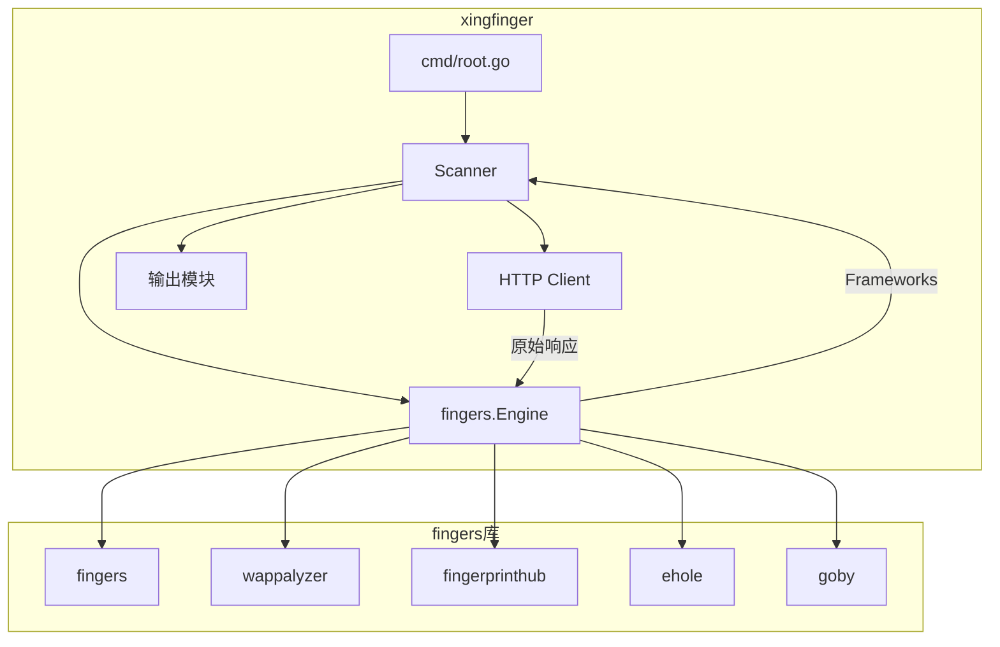

# 设计文档

## 概述

本设计文档描述如何将 chainreactors/fingers 指纹识别引擎集成到 xingfinger 项目中，替换现有的自定义指纹匹配逻辑。

fingers 是一个多指纹库聚合识别引擎，支持以下指纹库：
- fingers（自有指纹库）
- wappalyzer（Web 技术检测）
- fingerprinthub（指纹中心）
- ehole（棱洞指纹）
- goby（Goby 指纹）
- nmap（服务指纹）

## 架构



## 组件和接口

### 1. Scanner 结构体（重构）

```go
// Scanner 指纹扫描器
// 负责并发扫描 URL 并使用 fingers 引擎进行指纹识别
type Scanner struct {
    queue        *queue.Queue      // URL 任务队列
    wg           sync.WaitGroup    // 等待组，用于同步 goroutine
    mu           sync.Mutex        // 互斥锁，保护结果切片
    thread       int               // 并发线程数
    output       string            // 输出文件路径
    proxy        string            // 代理地址
    silent       bool              // 静默模式
    allResults   []Result          // 所有扫描结果
    hitResults   []Result          // 命中指纹的结果
    engine       *fingers.Engine   // fingers 指纹识别引擎（新增）
}
```

### 2. 初始化流程

```go
// NewScanner 创建扫描器
// 初始化 fingers 引擎，如果失败则退出程序
func NewScanner(urls []string, thread int, output, proxy string, timeout int, silent bool) *Scanner {
    // 1. 初始化 fingers 引擎
    engine, err := fingers.NewEngine()
    if err != nil {
        fmt.Printf("[!] 初始化指纹引擎失败: %v\n", err)
        os.Exit(1)
    }
    
    // 2. 创建扫描器实例
    s := &Scanner{
        queue:      queue.NewQueue(),
        thread:     thread,
        output:     output,
        proxy:      proxy,
        silent:     silent,
        allResults: []Result{},
        hitResults: []Result{},
        engine:     engine,  // 存储引擎实例
    }
    
    // 3. 添加 URL 到队列
    for _, url := range urls {
        s.queue.Push([]string{url, "0"})
    }
    
    return s
}
```

### 3. 指纹检测流程

```go
// detectFingerprints 使用 fingers 引擎检测指纹
// 参数：
//   - rawResponse: 原始 HTTP 响应（包含 header 和 body）
// 返回：
//   - []string: 检测到的框架名称列表
func (s *Scanner) detectFingerprints(rawResponse []byte) []string {
    // 使用 DetectContent 进行指纹检测
    frameworks, err := s.engine.DetectContent(rawResponse)
    if err != nil {
        return nil
    }
    
    // 提取框架名称
    return frameworks.GetNames()
}
```

### 4. HTTP 响应处理（修改）

```go
// Response HTTP 响应结构体
type Response struct {
    URL        string              // 请求 URL
    RawContent []byte              // 原始响应内容（新增，供 fingers 使用）
    Body       string              // 响应体
    Header     map[string][]string // 响应头
    Server     string              // 服务器信息
    StatusCode int                 // 状态码
    Length     int                 // 响应长度
    Title      string              // 页面标题
    JsURLs     []string            // JS 跳转 URL
}

// fetch 发送 HTTP 请求并返回原始响应
// 修改：保存原始响应内容供 fingers 引擎使用
func fetch(task []string, proxy string) (*Response, error) {
    // ... HTTP 请求代码 ...
    
    // 读取原始响应
    rawBody, _ := ioutil.ReadAll(resp.Body)
    
    // 构建原始 HTTP 响应格式
    var rawResponse bytes.Buffer
    rawResponse.WriteString(fmt.Sprintf("HTTP/%d.%d %d %s\r\n", 
        resp.ProtoMajor, resp.ProtoMinor, resp.StatusCode, resp.Status))
    for k, v := range resp.Header {
        rawResponse.WriteString(fmt.Sprintf("%s: %s\r\n", k, strings.Join(v, ", ")))
    }
    rawResponse.WriteString("\r\n")
    rawResponse.Write(rawBody)
    
    return &Response{
        URL:        task[0],
        RawContent: rawResponse.Bytes(),  // 原始响应
        Body:       body,
        // ... 其他字段 ...
    }, nil
}
```

## 数据模型

### Result 结构体（保持不变）

```go
// Result 扫描结果
// 保持与现有格式兼容，确保输出不变
type Result struct {
    URL        string `json:"url"`         // 目标 URL
    CMS        string `json:"cms"`         // 检测到的 CMS/框架
    Server     string `json:"server"`      // 服务器信息
    StatusCode int    `json:"status_code"` // HTTP 状态码
    Length     int    `json:"length"`      // 响应长度
    Title      string `json:"title"`       // 页面标题
}
```

## 正确性属性

*正确性属性是指在系统所有有效执行中都应该保持为真的特征或行为——本质上是关于系统应该做什么的形式化陈述。属性作为人类可读规范和机器可验证正确性保证之间的桥梁。*

### Property 1: 引擎实例共享

*对于任意* Scanner 实例和任意数量的并发扫描 goroutine，所有 goroutine 应该使用同一个 fingers.Engine 实例。

**验证: 需求 1.3**

### Property 2: 框架名称提取

*对于任意* 有效的 Frameworks 结果，GetNames() 应该返回所有非猜测（non-guess）框架的名称列表。

**验证: 需求 2.2**

### Property 3: 多框架连接

*对于任意* 包含 N 个框架名称的列表（N > 1），用逗号连接后的字符串应该包含 N-1 个逗号。

**验证: 需求 3.2**

### Property 4: JSON 序列化往返

*对于任意* 有效的 Result 结构体，序列化为 JSON 后再反序列化应该得到等价的结构体。

**验证: 需求 3.3**

### Property 5: 输出格式完整性

*对于任意* 扫描结果，httpx 风格输出应该包含 URL、状态码、响应长度，以及可选的服务器、标题和 CMS 信息。

**验证: 需求 3.1**

## 错误处理

| 错误场景 | 处理方式 |
|---------|---------|
| fingers 引擎初始化失败 | 打印错误信息并退出程序 |
| HTTP 请求失败 | 尝试切换协议（https→http），仍失败则跳过 |
| 指纹检测返回错误 | 记录日志，返回空结果 |
| JSON 保存失败 | 打印错误信息 |

## 测试策略

### 单元测试

1. **引擎初始化测试**: 验证 `fingers.NewEngine()` 正确初始化
2. **框架名称提取测试**: 验证从 Frameworks 正确提取名称
3. **输出格式测试**: 验证 httpx 风格输出格式正确

### 属性测试

使用 Go 的 `testing/quick` 包进行属性测试：

1. **Property 3 测试**: 生成随机框架名称列表，验证逗号数量
2. **Property 4 测试**: 生成随机 Result，验证 JSON 往返一致性

### 集成测试

1. 使用已知指纹的测试 URL 验证检测准确性
2. 验证并发扫描的正确性和稳定性

## 文件变更清单

### 删除的文件

- `finger.json` - 旧指纹库文件
- `module/finger/getfingerfile.go` - 指纹加载函数
- `module/finger/matchfinger.go` - 关键字/正则匹配
- `module/finger/faviconhash.go` - favicon 哈希计算

### 修改的文件

- `module/finger/finger.go` - 集成 fingers 引擎
- `module/finger/http.go` - 返回原始 HTTP 响应
- `go.mod` - 添加 fingers 依赖

### 保持不变的文件

- `cmd/root.go` - 命令行入口
- `module/finger/output.go` - 输出函数
- `module/finger/encoding.go` - 编码处理
- `module/finger/jsjump.go` - JS 跳转解析
- `module/queue/queue.go` - 任务队列
